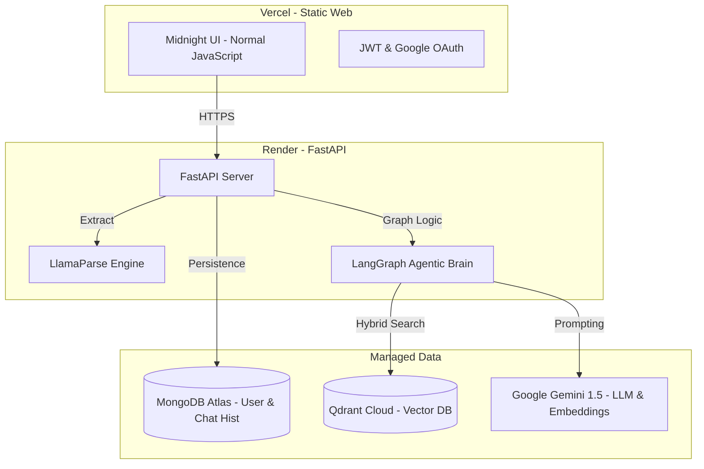

# 📚 PaperMind AI: Technical Site Manual
### *Advanced Agentic Research Platform for Premium Academic Analysis*

PaperMind AI is a high-fidelity, cloud-native research platform designed to transform static PDFs into interactive, data-driven intelligence. By leveraging an "Agentic RAG" (Retrieval-Augmented Generation) pipeline, it allows researchers to chat with complex documents, extract hidden tables, and receive expert-level briefings.

---

## 🏗️ 1. Technical Architecture
The platform has been upgraded from a local-only prototype to a robust, decentralized cloud architecture.

---

## 🚀 2. Upgraded Tech Stack (Cloud-Native)

### **A. Neural Processing & Search (Hybrid Paradigm)**
- **Dense Embedding**: `Google Gemini-Embedding-004` (State-of-the-art semantic understanding).
- **Sparse Embedding**: `Hugging Face SPLADE (prithvida/Splade_PP_en_v1)` (Powerful keyword-based retrieval).
- **Vector Engine**: `Qdrant Cloud` (Combines both Gemini and SPLADE vectors into a single Hybrid Search query).
- **Orchestration**: `LangGraph` (Enables "Agentic" behaviors: multi-step retrieval, self-correction, and retry loops).

### **B. Parsing & Extraction**
- **Engine**: `LlamaParse` (Cloud-based deep parsing).
- **Table Specialist**: Custom Markdown Table logic to preserve structured data (rows/columns) for the LLM.
- **Hierarchy Detection**: Automatically splits papers into logical sections (Abstract, Methodology, Results) instead of arbitrary chunks.

---

## 🖥️ 3. Frontend: Midnight Dark Mode
The UI is built with zero-dependency Normal JavaScript for maximum performance and a "Premium" aesthetic.
- **Visuals**: Glassmorphism, proximity glows, and Interstate-style typography.
- **State Management**: LocalStorage for session persistence and JWT-based authentication.
- **Dynamic Routing**: Environment-aware API switching (Localhost vs Render).

---

## 📡 4. Backend API Reference

| Endpoint | Method | Description |
| :--- | :--- | :--- |
| `/auth/signup` | POST | Creates new user in MongoDB. |
| `/auth/login` | POST | Returns JWT Access Token. |
| `/upload` | POST | Triggers the LlamaParse + Qdrant Ingestion pipeline. |
| `/chat` | POST | Starts an Agentic workflow (Graph Agent) to answer questions. |
| `/history/{id}`| GET | Retrieves persistent chat history from MongoDB. |
| `/papers` | GET | Lists all papers associated with the logged-in user. |

---

## ☁️ 5. Deployment Guide

### **Backend: Render Deployment**
1. **GitHub Connection**: Link the `backend` directory.
2. **Environment Variables**: Add the keys from Section 6.
3. **Build Command**: `pip install -r requirements.txt`
4. **Start Command**: 
   `gunicorn -w 4 -k uvicorn.workers.UvicornWorker main:app --bind 0.0.0.0:$PORT`

### **Frontend: Vercel Deployment**
1. **Root Directory**: Select the `frontend` folder.
2. **Framework**: "Other" (Static HTML).
3. **Automatic URL**: Vercel handles SSL and performance.

---

## 🔑 6. Environment Variables Reference
Ensure these are set in your `.env` file (Local) and Render Dashboard (Production).

| Variable | Description |
| :--- | :--- |
| `GEMINI_API_KEY` | Google AI Studio Key. |
| `MONGODB_URI` | MongoDB Atlas Connection String (`mongodb+srv://...`). |
| `QDRANT_URL` | Your Qdrant Cloud Cluster URL. |
| `QDRANT_API_KEY` | Your Qdrant Cloud API Key. |
| `LLAMA_CLOUD_API_KEY` | Llama Cloud Key for PDF parsing. |
| `SECRET_KEY` | Random string for JWT encryption. |
| `HUGGINGFACE_API_KEY`| Used for SPLADE sparse fallback. |

---

## 🛠️ 7. Management Commands
Run these in the terminal to maintain the project:
- **Run Local Backend**: `uvicorn main:app --reload --port 8000`
- **Clear Cloud Vectors**: (Via provided scratch script) `python scratch/clear_db.py`
- **Clean Local Cache**: `rm -rf uploads/*`

---
*Documentation Version: 2.0.0 (Cloud-Native Update)*  
*Generated for: Sinthia Gupta / PaperMind AI Project*
